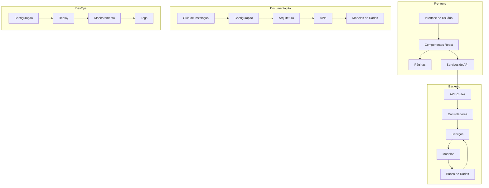

# Documentação Oficial - DevOrbit

## Estrutura do Projeto

O diagrama acima representa a arquitetura da plataforma DevOrbit, dividida em quatro áreas principais:

### Frontend

- Interface do usuário e componentes React
- Páginas e rotas da aplicação
- Serviços para comunicação com API

### Backend

- Rotas da API
- Controladores para lógica de negócio
- Serviços e modelos de dados
- Integração com banco de dados

### Documentação

- Guias de instalação e configuração
- Documentação da arquitetura
- Documentação das APIs
- Modelos e esquemas de dados

### DevOps

- Configurações de ambiente
- Processos de deploy
- Sistema de monitoramento
- Gerenciamento de logs

## Contribuição

Como Contribuir

Explique como outras pessoas podem contribuir para o projeto.

## Padrões de Código

Descreva os padrões e boas práticas que devem ser seguidos.

## Pull Requests

Explique como fazer um pull request.

## Licença

Projeto feito com amor e protegido pela **GNU AGPLv3.**

## Arquivo de Licença

https://github.com/Gilderlan0101/DevOrbit/blob/master/LICENSE

## Créditos

Autores

https://github.com/Gilderlan0101
https://github.com/nvpanda

https://github.com/joaosilvateixeira33

## Agradecimentos

DevOrbit agradece a todos os envolvidos no projeto e a todos que colaboraram e colaboram com o crescimento do mesmo. Feito com carinho e todo amor do mundo por seus mentores e desenvolvedores.